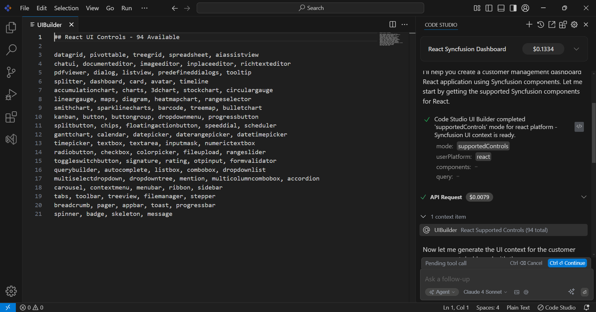
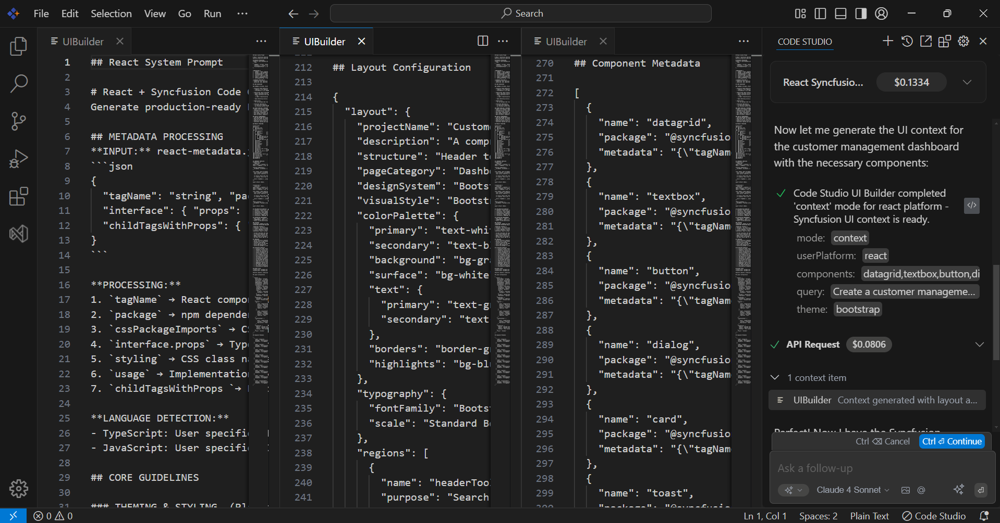

# UI Builder User Guide

## Overview

### What is UI Builder?

UI Builder is an AI-powered development assistant integrated into Syncfusion Code Studio. It provides essential implementation details and component metadata to enable feature development using Syncfusion components. By analyzing your requirements through natural language prompts, UI Builder intelligently delivers the necessary information and guidance for implementing your desired functionality with the most suitable Syncfusion components.

### Key Benefits

- **Smart Implementation**: Leverages Syncfusion components to efficiently build required features.
- **Intelligent Component Selection**: Analyzes requirements and selects optimal Syncfusion controls.
- **Multi-Platform Support**: Implements features across 14 platforms with platform-specific optimizations.
- **Time-Saving**: Eliminates manual component research and configuration.
- **Best Practices**: Applies Syncfusion's proven implementation patterns.

## Getting Started

### UI Builder Setup

1. **Access Chat Interface**: Open the chat panel in Code Studio.
2. **Enable UI Builder Tool**: Select "UI Builder" from the tools panel.
3. **Choose Mode**: Select between Automatic or Ask First mode.


### Syncfusion Component Licensing

After implementing features with Syncfusion components, proper licensing is required to run your application without licensing pop-ups. If you installed the trial setup or NuGet packages from nuget.org, you must register the Syncfusion license key in your application. Without proper licensing, a licensing pop-up will appear when running your application. The license key can be obtained from the [My Account » License and downloads section](https://www.syncfusion.com/account/downloads) of the Syncfusion® website. To obtain a license key, you will need one of the following:

- **Trial License**: For evaluation purposes with trial installer or NuGet packages
- **Licensed Version**: For commercial use with licensed installer (no license key registration required)

### Basic Prompt Structure
```
Develop [feature description] for [platform] application using Syncfusion components with [specific requirements]
```

**Required Elements:**
- Include "Syncfusion" keyword (activates UI Builder)
- Specify target platform (React, Angular, Vue, etc.)
- Describe desired functionality

## Developer Workflow

### Step 1: Initial Implementation
Start with a feature request:

```
Create a customer management dashboard React application using Syncfusion components with data grid and search functionality.
```

UI Builder will analyze your request and provide the necessary information for implementing the feature using appropriate Syncfusion components.

### Step 2: Feature Enhancement
Build upon the initial implementation:

```
Enhance the existing customer management dashboard React application using Syncfusion components to include Excel export and form validation.
```

## How UI Builder Works

#### Supported Controls API Response
UI Builder responds to the supportedControls API call by providing a comprehensive list of available Syncfusion controls specific to the detected platform.



#### Context API Response
UI Builder responds to the Context API call by providing three essential components: System Prompt, Layout Configuration, and Controls Metadata.



#### AI Model Implementation
Based on the information provided by UI Builder (supported controls list, system prompt, layout configuration, and metadata), the AI model begins implementation in the application.

### AI Model Integration

#### Recommended Models

- **GPT-4**: Advanced feature implementation with complex component integration
- **Claude**: Precise implementation with optimization focus

## Supported Platforms

UI Builder provides implementation support for Syncfusion components across 14 platforms:

| Platform | Controls | Status |
|----------|----------|--------|
| React | 94 | ✅ Full Support |
| PureReact | 17 | ✅ Full Support |
| Angular | 97 | ✅ Full Support |
| Vue.js | 95 | ✅ Full Support |
| JavaScript | 97 | ✅ Full Support |
| TypeScript | 97 | ✅ Full Support |
| Blazor | 102 | ✅ Full Support |
| ASP.NET Core | 99 | ✅ Full Support |
| ASP.NET MVC | 99 | ✅ Full Support |
| MAUI | 74 | ✅ Full Support |
| WPF | 101 | ✅ Full Support |
| WinForms | 125 | ✅ Full Support |
| WinUI | 41 | ✅ Full Support |
| Flutter | 25 | ✅ Full Support |
| Java | 1 | ✅ Full Support |

## Available Controls

### Core Component Categories

- **Data Management**: DataGrid, TreeGrid, PivotTable, Spreadsheet
- **Charts & Visualization**: Charts (20+ types), Gauges, Maps, Diagram
- **Input Controls**: TextBox, DatePicker, ColorPicker, FileUpload
- **Navigation**: Menu, Toolbar, Tabs, Sidebar, Accordion
- **AI Components**: AIAssistView, ChatUI, SmartPaste, SmartTextArea
- **Editors**: RichTextEditor, PDFViewer, ImageEditor, WordProcessor

## Best Practices

### For Optimal Implementation

1. **Include "Syncfusion" Keyword**: Always include "Syncfusion" in your prompt to trigger UI Builder activation.
2. **Be Specific**: Include detailed functionality requirements.
3. **Specify Platform**: Always mention the target framework for optimized implementation.
4. **Include Data Context**: Describe data structure and relationships.
5. **Request Features**: Specify needed capabilities (search, export, validation).

### Performance Optimization

- Request virtual scrolling for large datasets
- Specify lazy loading requirements
- Include caching strategies
- Mention responsive design needs

## Troubleshooting

### Common Issues

**UI Builder Not Activating**
- Confirm that the prompt includes the "Syncfusion" keyword and the platform name.
- Verify that the UI Builder tool is set to either Automatic or Ask First mode.

**Incorrect Platform Detection**
- Specify platform explicitly in the prompt.

**Generic Implementation**
- Provide more specific requirements.
- Include business context and constraints.
- Request detailed implementation examples.

## FAQ

**Does UI Builder create complete applications?**

UI Builder provides the necessary component information and metadata that enables Code Studio to implement specific features using existing Syncfusion components. You integrate these implementations into your application structure.

**Can I modify the implemented features?**

Yes! The implemented code using Syncfusion components is yours to customize and extend as needed.

**Which AI models work best?**

GPT-4 and Claude provide optimal results. Configure your preferred model in Code Studio settings.

**Is there a limit on feature implementation?**

There are no limits on the number of features you can implement, subject to your AI model usage limits.

**Can UI Builder work with existing projects?**

Yes! UI Builder provides the component information that enables the implementation of features using Syncfusion components that integrate with existing codebases.